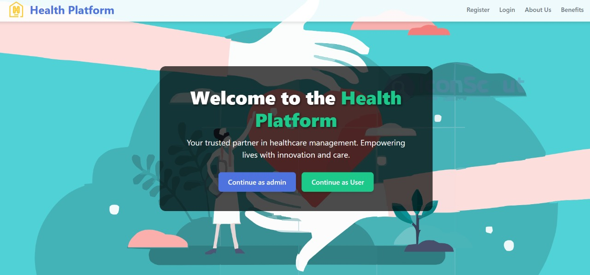

# Health-Hustle 🏃‍♂️💪



Health-Hustle is a full-stack fitness tracking dashboard that uses the Fitbit API to track and display personal fitness information in an interactive and fun manner. It supports progress tracking, health advice, leaderboard challenges, and a responsive user interface.

---

## 📑 Table of Contents

- [Introduction](#introduction)
- [Tech Stack](#tech-stack)
- [Functioning of Model](#functioning-of-model)
- [Features](#features)
- [Quick Start](#quick-start)
- [Snippets](#snippets)
- [Links](#links)
- [More](#more)

---

## 📌 Introduction

Health-Hustle is designed to help users visualize their fitness metrics using Fitbit's data, track daily goals, and participate in leaderboard-based motivation challenges. Whether you're a fitness enthusiast or just starting out, this app makes staying on track easier and more fun.


---

## 🧰 Tech Stack

- **Frontend**: React.js, CSS
- **Backend**: Node.js, Express.js
- **OAuth Integration**: Fitbit OAuth2
- **Database**: MongoDB
- **Version Control**: Git + GitHub

---

## ⚙️ Functioning of Model

1. **OAuth Authorization**: Users authenticate with Fitbit using OAuth2.
2. **Data Fetching**: Access tokens are used to fetch step counts, heart rate, calories, etc.
3. **Data Display**: Stats are shown via React components with progress indicators.
4. **Leaderboard Logic**: Users are compared on key metrics for ranking.
5. **Health Tips Engine**: Based on metrics, users get personalized health suggestions.

---

## ✨ Features

- 🚶 Step counter with circular progress
- 🔐 Fitbit OAuth authentication
- 🏆 Leaderboard and challenges
- 📈 Visual graphs of daily and weekly activity
- 🩺 Health tips based on live metrics
- 📱 Responsive design for mobile/desktop
- 🌗 Light/Dark theme support *(optional)*

---

## ⚡ Quick Start

```bash
# Clone the repo
git clone https://github.com/Shivamgoyal5/Health-Hustle.git

# Navigate to client and install dependencies
cd fitbit-client-main/client
npm install

# Navigate to server and install dependencies
cd ../../server
npm install

# Create .env files for client and server with your Fitbit credentials

# Start the development servers
# In client folder
npm start

# In server folder
node index.js
